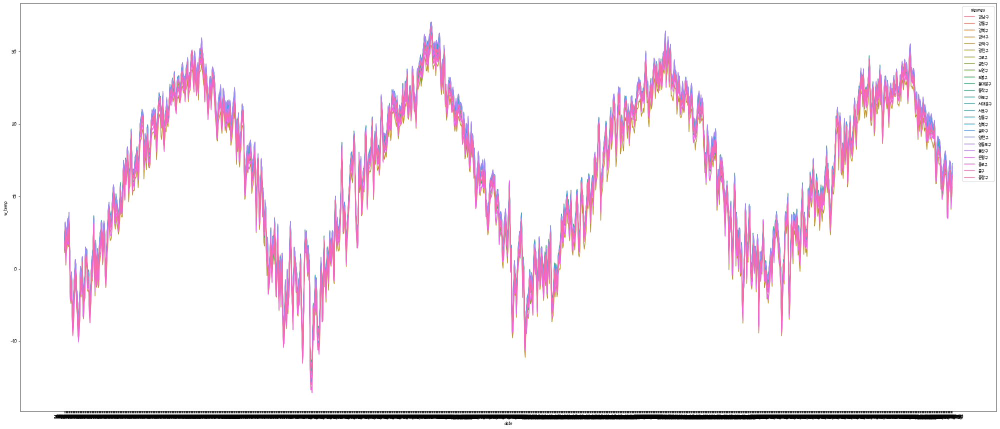
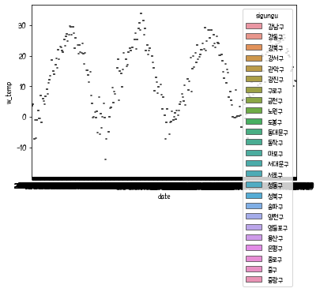

### *방재기상관측(AWS) 데이터 전처리 일별*
#### - 250개 시군구 기준으로 날씨를 정리함
> 1. 시군구의 위경도와 센서간의 유클리드 거리 계산
    - 시군구 위경도 기준으로 센서들의 위경도로 유클리드 거리를 추출
> 2. 거리 별 가중치를 계산하여 각 날씨 관련 변수를 계산
    - 정리된 시군구와 센서의 거리 정보를 실제 센서 값을 결합함 (온도가 없는 경우를 제거하여 
      실데이터가 존재하는 센서만 사용)
    - 최고, 최저 온도 발생 시각 및 최고풍속 발생 시각은 초 단위로 계산하여 가중치 적용
    - 결합된 센서들 중 top3에 가중치를 적용하여 가 지역별 변수값 추출
    
#### - 가중치 적용 공식
>  - w1 = 1/2 * (1 - {|d-a1|/(|d-a1| + |d-a2| + |d-a3| + |d-a4|)})
>  - w2 = 1/2 * (1 - {|d-a2|/(|d-a1| + |d-a2| + |d-a3| + |d-a4|)})
>  - w3 = 1/2 * (1 - {|d-a3|/(|d-a1| + |d-a2| + |d-a3| + |d-a4|)})

### - 원천 데이터 리스트
>  - sigungu_xy.csv (시군구)
>  - censerinfo.csv (센서데이터)
>  - OBS_AWS_DD_201701_202010.csv (센서별 날씨관련 변수)


```python
import pyspark
from pyspark.sql import SparkSession
from pyspark.sql.functions import mean,col,split, col, regexp_extract, when, lit

spark = SparkSession.builder.master("local[2]") \
                    .appName('sparkedu') \
                    .getOrCreate()
spark
```


    <div>
        <p><b>SparkSession - in-memory</b></p>

<div>
    <p><b>SparkContext</b></p>

    <p><a href="http://localhost:4040">Spark UI</a></p>

    <dl>
      <dt>Version</dt>
        <dd><code>v3.0.1</code></dd>
      <dt>Master</dt>
        <dd><code>local[2]</code></dd>
      <dt>AppName</dt>
        <dd><code>sparkedu</code></dd>
    </dl>
</div>

    </div>


### 1. 250개의 시군구 위경도 로딩하여 전처리

#### 1.1 시군구 위경도 로딩 컬럼 타입 수정 및 sql사용을 위해 데이터셋 등록


```python
SigunguXY = spark\
          .read\
          .option("inferSchema", "true")\
          .option("header", "true")\
          .csv("data/sigungu_xy.csv")
SigunguXY = SigunguXY.withColumn("sigungu_x", SigunguXY.sigungu_x.cast("float")).withColumn("sigungu_y", SigunguXY.sigungu_y.cast("float"))
SigunguXY.createOrReplaceTempView("Sigunguxy")
print(SigunguXY.count())
# 250
```

    250
    

#### 1.2 검증


```python
print(SigunguXY.count())
print(SigunguXY.distinct().count())
SigunguXY.describe().show()
SigunguXY.show(2)
# 250
```

    250
    250
    +-------+--------+-------+------------------+------------------+
    |summary|    sido|sigungu|         sigungu_x|         sigungu_y|
    +-------+--------+-------+------------------+------------------+
    |  count|     250|    250|               250|               250|
    |   mean|    null|   null|127.63907656860351| 36.41521324157715|
    | stddev|    null|   null| 0.912011813226167|1.0729488769413968|
    |    min|  강원도| 가평군|         124.67009|         33.254066|
    |    max|충청북도| 횡성군|         130.90572|         38.380592|
    +-------+--------+-------+------------------+------------------+
    
    +------+-------+---------+---------+
    |  sido|sigungu|sigungu_x|sigungu_y|
    +------+-------+---------+---------+
    |강원도| 강릉시| 128.8759| 37.75211|
    |강원도| 고성군|128.46786|38.380592|
    +------+-------+---------+---------+
    only showing top 2 rows
    
    

### 2. 524개의 센서 데이터를 전처리

#### 2.1 데이터 로딩, 컬럼 타입 수정 및 sql사용을 위해 데이터셋 등록


```python
SenserInfo = spark\
          .read\
          .option("inferSchema", "true")\
          .option("header", "true")\
          .csv("data/censerinfo.csv")
SenserInfo = SenserInfo.withColumn("x", SenserInfo.x.cast("float")).withColumn("y", SenserInfo.y.cast("float"))
SenserInfo.createOrReplaceTempView("SenserInfo")
print(SenserInfo.count())
# 1893
```

    1893
    

#### 2.2 데이터 정리 - 이력관리 되고 있는 센서 위치 정보를 최근으로 데이터로 가져 오고 필요 데이터만 으로 subset을 만듬


```python
print(SenserInfo.distinct().count())
SenserInfo.describe().show()
# SenserInfo.show()
# 1893
```

    1893
    +-------+-----------------+-------------------+-------------------+-----------+------------------+------------------+------------------+------------------+------------------+
    |summary|         senserid|          startdate|            enddate|sernsername|                 x|                 y|region_1depth_name|region_2depth_name|region_3depth_name|
    +-------+-----------------+-------------------+-------------------+-----------+------------------+------------------+------------------+------------------+------------------+
    |  count|             1893|               1893|               1893|       1893|              1893|              1893|              1893|              1893|              1893|
    |   mean|693.0612783940835|               null|               null|       null|127.53129761419281|36.158902869045704|              null|              null|              null|
    | stddev| 174.599815603351|               null|               null|       null|0.9911930175069503|1.3313135706812764|              null|              null|              null|
    |    min|               12|1989-06-27 00:00:00|1996-12-31 00:00:00|     가거도|          124.6305|           33.1137|            강원도|            가평군|            가산동|
    |    max|              978|2020-10-30 00:00:00|2222-12-31 00:00:00|       후포|          131.8698|           38.5441|          충청북도|            횡성군|            흑산면|
    +-------+-----------------+-------------------+-------------------+-----------+------------------+------------------+------------------+------------------+------------------+
    
    

#### 2.3 유지되고 있는 센서 이력은 enddate가 공백이고 유지되지 않는 센서는 enddate에 작동 중지 일이 등록 되어 있음 (csv파일에 enddate가 공백인 경우 2222년을 등록)


```python
LastSenserInfo = spark.sql("""
SELECT A.senserid, A.sernsername, A.x AS senser_x, A.y AS senser_y,
        A.region_1depth_name AS senser_region_1,  
        A.region_3depth_name AS senser_region_2,  
        A.region_2depth_name AS senser_region_3
FROM SenserInfo AS A

INNER JOIN (
    SELECT senserid, max(enddate) AS lenddate
    FROM SenserInfo
    GROUP BY senserid
    ) AS B
ON A.senserid = B.senserid
AND A.enddate = B.lenddate

WHERE 1 = 1

""")
LastSenserInfo.createOrReplaceTempView("LastSenserInfo")
LastSenserInfo.describe().show()
print(LastSenserInfo.count())
# 524
```

    +-------+-----------------+-----------+------------------+------------------+---------------+---------------+---------------+
    |summary|         senserid|sernsername|          senser_x|          senser_y|senser_region_1|senser_region_2|senser_region_3|
    +-------+-----------------+-----------+------------------+------------------+---------------+---------------+---------------+
    |  count|              524|        524|               524|               524|            524|            524|            524|
    |   mean|679.4561068702291|       null|127.52589231593008|36.187192130634806|           null|           null|           null|
    | stddev|184.2299668080408|       null|1.0150116146748691| 1.364833816970453|           null|           null|           null|
    |    min|               12|     가거도|          124.6305|           33.1221|         강원도|         가산면|         가평군|
    |    max|              978|       횡성|          131.8698|           38.5439|       충청북도|         흑산면|         횡성군|
    +-------+-----------------+-----------+------------------+------------------+---------------+---------------+---------------+
    
    524
    

### 3. 시군구 와 센서의 위경도 값을 이용하여 유클리드 거리 계산 (250 * 524 = 131000의 조합)

#### 3.1 시군구별 전체 센서의 조합을 위해 full join


```python
Sigungu_dist = spark.sql("""
SELECT *
FROM SigunguXY AS A

FULL JOIN LastSenserInfo AS B

WHERE 1 = 1
-- AND A.sigungu = '강릉시'

""")
Sigungu_dist.createOrReplaceTempView("Sigungu_dist")
print(Sigungu_dist.count())
Sigungu_dist.show(2)
# 250 * 524 = 131000
```

    131000
    +------+-------+---------+---------+--------+-----------+--------+--------+---------------+---------------+---------------+
    |  sido|sigungu|sigungu_x|sigungu_y|senserid|sernsername|senser_x|senser_y|senser_region_1|senser_region_2|senser_region_3|
    +------+-------+---------+---------+--------+-----------+--------+--------+---------------+---------------+---------------+
    |강원도| 강릉시| 128.8759| 37.75211|      12| 안면도(감)|126.3167| 36.5333|       충청남도|         안면읍|         태안군|
    |강원도| 고성군|128.46786|38.380592|      12| 안면도(감)|126.3167| 36.5333|       충청남도|         안면읍|         태안군|
    +------+-------+---------+---------+--------+-----------+--------+--------+---------------+---------------+---------------+
    only showing top 2 rows
    
    

#### 3.2 유클리드 거리 및 순위 추출 (pyspark dataframe에서 처리 어려워 pandas 객체로 변환하여처리)


```python
# 유클리드 거리 계산 함수
from scipy.spatial import distance
print(distance.euclidean((128.8759061, 37.75210808), (126.3167, 36.5333)))
print(distance.euclidean((128.8759061, 37.75210808), (128.8759061, 37.75210808)))
print(distance.euclidean((0, 0), (365, 365)))
```

    2.8346126716273883
    0.0
    516.1879502661797
    


```python
# pyspark dataframe에서 처리 어려워 pandas 객체로 변환하여처리
from scipy.spatial import distance
# print(distance.euclidean((128.8759061, 37.75210808), (126.3167, 36.5333)))
print('변환 전', type(Sigungu_dist))
# Sigunguxy_dist['distance'] = Sigunguxy_dist.map(lambda x : distance.euclidean((x['sigungu_x'], x['sigungu_y']), (x['x'], x['y'])), axis=1)

#유클리드 함수가 안 돌아 가서 pdf로 변환 후 처리
pdf_Sigungu_dist = Sigungu_dist.toPandas()
print('변환 후', type(pdf_Sigungu_dist))
pdf_Sigungu_dist['udistance'] = pdf_Sigungu_dist.apply(lambda x : distance.euclidean((x['sigungu_x'], x['sigungu_y']), (x['senser_x'], x['senser_y'])), axis=1)
# 다시 스파크 프레임으로 변환
Sigungu_dist = spark.createDataFrame(pdf_Sigungu_dist)
Sigungu_dist.createOrReplaceTempView("Sigungu_dist")
print('유클리드 거리 추가 후 다시변환', type(Sigungu_dist))
print(Sigungu_dist.count())
Sigungu_dist.show(2)
# 131000
```

    변환 전 <class 'pyspark.sql.dataframe.DataFrame'>
    변환 후 <class 'pandas.core.frame.DataFrame'>
    유클리드 거리 추가 후 다시변환 <class 'pyspark.sql.dataframe.DataFrame'>
    131000
    +------+-------+------------------+------------------+--------+-----------+------------------+-----------------+---------------+---------------+---------------+------------------+
    |  sido|sigungu|         sigungu_x|         sigungu_y|senserid|sernsername|          senser_x|         senser_y|senser_region_1|senser_region_2|senser_region_3|         udistance|
    +------+-------+------------------+------------------+--------+-----------+------------------+-----------------+---------------+---------------+---------------+------------------+
    |강원도| 강릉시| 128.8759002685547| 37.75210952758789|      12| 안면도(감)|126.31670379638672|36.53329849243164|       충청남도|         안면읍|         태안군| 2.834605249867365|
    |강원도| 고성군|128.46786499023438|38.380592346191406|      12| 안면도(감)|126.31670379638672|36.53329849243164|       충청남도|         안면읍|         태안군|2.8354874473456375|
    +------+-------+------------------+------------------+--------+-----------+------------------+-----------------+---------------+---------------+---------------+------------------+
    only showing top 2 rows
    
    

### <span style="color:red">  *여기서 시도군 별 top3를 추출하여 모수를 줄여서 진행하면 좋은데 실제 센서 데이터 중 top3에 빠지는 경우가 발생하여 전체를 모든 센서와 비교하여 top3를 추출해야 함 - 로직수정 ㅠㅠ*

### 3. 일/시간별 센서 정보에 정리된 시군구 * 센서데이터 mapping

#### 3.1 날씨정보 로딩 및 필요 정보 정리


```python
AWS = spark\
          .read\
          .option("inferSchema", "true")\
          .option("charset","euc-kr")\
          .option("header", "true")\
          .csv("data/OBS_AWS_DD_201701_202010.csv")
AWS = AWS.toDF("senserid", "sersername", "date", "temp", "ltemp", "ltemptime", "htemp", "htemptime", \
                                               "rainfall", "hwindspeed", "hwindspeedtime", "avgwindspeed", "hwindspeeddeg")
AWS.createOrReplaceTempView("AWS")
print(AWS.count())
AWS.show(2)
AWS.printSchema()
# 702506
```

    702506
    +--------+----------+----------+----+-----+---------+-----+---------+--------+----------+--------------+------------+-------------+
    |senserid|sersername|      date|temp|ltemp|ltemptime|htemp|htemptime|rainfall|hwindspeed|hwindspeedtime|avgwindspeed|hwindspeeddeg|
    +--------+----------+----------+----+-----+---------+-----+---------+--------+----------+--------------+------------+-------------+
    |      12|안면도(감)|2017-01-01| 7.1|  4.7|      527| 10.3|     1324|     0.0|       5.8|          1243|         2.2|        200.2|
    |      12|안면도(감)|2017-01-02| 7.4|  5.2|     2322| 11.6|     1314|     0.0|       7.1|          1612|         2.2|          7.5|
    +--------+----------+----------+----+-----+---------+-----+---------+--------+----------+--------------+------------+-------------+
    only showing top 2 rows
    
    root
     |-- senserid: integer (nullable = true)
     |-- sersername: string (nullable = true)
     |-- date: string (nullable = true)
     |-- temp: double (nullable = true)
     |-- ltemp: double (nullable = true)
     |-- ltemptime: integer (nullable = true)
     |-- htemp: double (nullable = true)
     |-- htemptime: integer (nullable = true)
     |-- rainfall: double (nullable = true)
     |-- hwindspeed: double (nullable = true)
     |-- hwindspeedtime: integer (nullable = true)
     |-- avgwindspeed: double (nullable = true)
     |-- hwindspeeddeg: double (nullable = true)
    
    


```python
AWS.describe().show()
```

    +-------+------------------+----------+----------+------------------+------------------+-----------------+------------------+------------------+------------------+-----------------+------------------+------------------+------------------+------------------+------------------+------------------+------------------+
    |summary|          senserid|sersername|      date|              temp|             ltemp|        ltemptime|             htemp|         htemptime|          rainfall|       hwindspeed|    hwindspeedtime|      avgwindspeed|     hwindspeeddeg|        ltemptime1|       ltemptime_s|       htemptime_s|  hwindspeedtime_s|
    +-------+------------------+----------+----------+------------------+------------------+-----------------+------------------+------------------+------------------+-----------------+------------------+------------------+------------------+------------------+------------------+------------------+------------------+
    |  count|            702506|    702506|    702506|            698544|            698247|           698247|            698247|            698247|            701830|           696879|            696879|            696101|            696588|            642267|            642267|            674946|            668197|
    |   mean| 679.3144727589515|      null|      null|12.913911507363919| 8.172095977497992|892.6154756124981|18.389700636021228|1334.2325208701218|3.8448897881253363|7.954892169228797|1301.0370939574875|2.0543039013016924|200.32820533791147| 35647.46726828562| 35647.46726828562|50386.043950182684| 49521.48713627867|
    | stddev|182.13445369967673|      null|      null| 9.669251334787006|10.332323456544922|796.2777984002544| 9.686656225211786|341.53525865572647|15.533688865377236|3.455473128330031| 548.0540326050395|1.5295155853770774|104.80352160659768|28376.925531280547|28376.925531280547| 8682.341249157016|17661.754151329078|
    |    min|                12|    가거도|2017-01-01|             -24.1|            -100.0|                0|             -19.8|                 0|               0.0|              0.0|                 0|               0.0|               0.0|              3600|              3600|              3600|              3600|
    |    max|               978|      횡성|2020-10-31|              34.4|              31.8|              959|              41.8|               959|            1004.0|             73.7|               959|              22.1|             360.0|             86340|             86340|             86340|             86340|
    +-------+------------------+----------+----------+------------------+------------------+-----------------+------------------+------------------+------------------+-----------------+------------------+------------------+------------------+------------------+------------------+------------------+------------------+
    
    


```python
from pyspark.sql.functions import expr
# 최고/최저온도 및 최고풍속 발생 시간은 초단위로 변환하여 가중치 적용 후 시간으로 변환
AWS = AWS.withColumn("ltemptime", AWS.ltemptime.cast("String")) \
                                .withColumn("htemptime", AWS.htemptime.cast("String")) \
                                .withColumn("hwindspeedtime", AWS.hwindspeedtime.cast("String"))

AWS = AWS.withColumn("ltemptime_s", expr("substring(ltemptime, 1, length(ltemptime)-2)").cast("int") * 3600 \
                                 + expr("substring(ltemptime, length(ltemptime)-1, length(ltemptime))").cast("int") * 60 )
AWS = AWS.withColumn("htemptime_s", expr("substring(htemptime, 1, length(htemptime)-2)").cast("int") * 3600 \
                                 + expr("substring(htemptime, length(htemptime)-1, length(htemptime))").cast("int") * 60 )
AWS = AWS.withColumn("hwindspeedtime_s", expr("substring(hwindspeedtime, 1, length(hwindspeedtime)-2)").cast("int") * 3600 \
                                 + expr("substring(hwindspeedtime, length(hwindspeedtime)-1, length(hwindspeedtime))").cast("int") * 60 )

AWS.createOrReplaceTempView("AWS")

print(AWS.count())
AWS.show(2)
# AWS.printSchema()
# 702506
```

    702506
    +--------+----------+----------+----+-----+---------+-----+---------+--------+----------+--------------+------------+-------------+----------+-----------+-----------+----------------+
    |senserid|sersername|      date|temp|ltemp|ltemptime|htemp|htemptime|rainfall|hwindspeed|hwindspeedtime|avgwindspeed|hwindspeeddeg|ltemptime1|ltemptime_s|htemptime_s|hwindspeedtime_s|
    +--------+----------+----------+----+-----+---------+-----+---------+--------+----------+--------------+------------+-------------+----------+-----------+-----------+----------------+
    |      12|안면도(감)|2017-01-01| 7.1|  4.7|      527| 10.3|     1324|     0.0|       5.8|          1243|         2.2|        200.2|     19620|      19620|      48240|           45780|
    |      12|안면도(감)|2017-01-02| 7.4|  5.2|     2322| 11.6|     1314|     0.0|       7.1|          1612|         2.2|          7.5|     84120|      84120|      47640|           58320|
    +--------+----------+----------+----+-----+---------+-----+---------+--------+----------+--------------+------------+-------------+----------+-----------+-----------+----------------+
    only showing top 2 rows
    
    


```python
SigunguWeather = spark.sql("""
SELECT A.sido, A.sigungu, B.senserid, B.sersername
       , A.udistance, B.date, B.temp, B.ltemp
       , B.ltemptime_s
       , B.htemp
       , B.htemptime_s
       , B.rainfall, B.hwindspeed
       , B.hwindspeedtime_s
       , B.avgwindspeed, B.hwindspeeddeg
FROM Sigungu_dist AS A

INNER JOIN AWS AS B
ON A.senserid = B.senserid
AND B.temp is not null
AND B.ltemp is not null 
AND B.htemp is not null
-- 센서 이상으로 온도가 나오지 않는 센서는 제거 하고 key별로 가까운 센서를 추출
WHERE 1 = 1

""")
SigunguWeather.createOrReplaceTempView("SigunguWeather")
print(SigunguWeather.count())
SigunguWeather.show(2)
# SigunguWeather.describe().show() # 개 오래 걸림 ㅋㅋ
# 175545250 # 하나의 센서가 여러 sigungu에서 쓰일 수 있음 ㅋㅋㅋㅋ 일 4년치 2억건 
# 온도의 null 제거 후 174405250
```

    174405250
    +------+-------+--------+----------+------------------+----------+----+-----+-----------+-----+-----------+--------+----------+----------------+------------+-------------+
    |  sido|sigungu|senserid|sersername|         udistance|      date|temp|ltemp|ltemptime_s|htemp|htemptime_s|rainfall|hwindspeed|hwindspeedtime_s|avgwindspeed|hwindspeeddeg|
    +------+-------+--------+----------+------------------+----------+----+-----+-----------+-----+-----------+--------+----------+----------------+------------+-------------+
    |강원도| 강릉시|     964|      마량|3.8845102818642188|2019-07-09|22.0| 20.0|      20940| 25.5|      42180|     0.0|       7.8|           19440|         1.6|         25.3|
    |강원도| 강릉시|     964|      마량|3.8845102818642188|2019-07-10|20.8| 20.1|      79680| 22.1|      13560|    20.5|      17.1|           20040|         3.7|         78.8|
    +------+-------+--------+----------+------------------+----------+----+-----+-----------+-----+-----------+--------+----------+----------------+------------+-------------+
    only showing top 2 rows
    
    

#### 3.2 유클리드 거리에 따라 작은 순으로 key별로 순위를 주고 top3 추출


```python
from pyspark.sql.window import Window
from pyspark.sql.functions import row_number

# 시군구 기준으로 센서들의 udistance에 따라 순위를 줌 
windowSpec  = Window.partitionBy("sido", "sigungu", "date").orderBy("udistance")
SigunguWeather = SigunguWeather.withColumn("row_number", row_number().over(windowSpec))

SigunguWeather.createOrReplaceTempView("SigunguWeather")

print(SigunguWeather.count())
SigunguWeather.show(2)
# 174405250
```

    174405250
    +------+-------+--------+----------+-------------------+----------+----+-----+-----------+-----+-----------+--------+----------+----------------+------------+-------------+----------+
    |  sido|sigungu|senserid|sersername|          udistance|      date|temp|ltemp|ltemptime_s|htemp|htemptime_s|rainfall|hwindspeed|hwindspeedtime_s|avgwindspeed|hwindspeeddeg|row_number|
    +------+-------+--------+----------+-------------------+----------+----+-----+-----------+-----+-----------+--------+----------+----------------+------------+-------------+----------+
    |강원도| 강릉시|     524|      강문|0.05938647192316765|2017-04-13|13.7|  6.3|      22260| 18.6|      65760|     0.0|      11.5|           78840|         3.8|        225.0|         1|
    |강원도| 강릉시|     566|      연곡|0.11451445804311591|2017-04-13|13.6|  3.7|      23700| 18.1|      72600|     0.0|      11.7|           79500|         3.2|        241.9|         2|
    +------+-------+--------+----------+-------------------+----------+----+-----+-----------+-----+-----------+--------+----------+----------------+------------+-------------+----------+
    only showing top 2 rows
    
    


```python
# udistance에 따른 순위 중 상위 3개만 추출
SigunguSenserTop3 = spark.sql("""
    SELECT *
    FROM SigunguWeather 
    WHERE 1 = 1
    AND row_number IN (1, 2, 3)
    """)
SigunguSenserTop3.createOrReplaceTempView("SigunguSenserTop3")
print(SigunguSenserTop3.count())
SigunguSenserTop3.show(2)
# 2017	365
# 2018	365
# 2019	365
# 2020	305
# 합게 1400
# 1050000 = 250sigungu * 3senser * 1400days
```

    1050000
    +------+-------+--------+----------+-------------------+----------+----+-----+-----------+-----+-----------+--------+----------+----------------+------------+-------------+----------+
    |  sido|sigungu|senserid|sersername|          udistance|      date|temp|ltemp|ltemptime_s|htemp|htemptime_s|rainfall|hwindspeed|hwindspeedtime_s|avgwindspeed|hwindspeeddeg|row_number|
    +------+-------+--------+----------+-------------------+----------+----+-----+-----------+-----+-----------+--------+----------+----------------+------------+-------------+----------+
    |강원도| 강릉시|     524|      강문|0.05938647192316765|2017-04-13|13.7|  6.3|      22260| 18.6|      65760|     0.0|      11.5|           78840|         3.8|        225.0|         1|
    |강원도| 강릉시|     566|      연곡|0.11451445804311591|2017-04-13|13.6|  3.7|      23700| 18.1|      72600|     0.0|      11.7|           79500|         3.2|        241.9|         2|
    +------+-------+--------+----------+-------------------+----------+----+-----+-----------+-----+-----------+--------+----------+----------------+------------+-------------+----------+
    only showing top 2 rows
    
    

#### 3.3 검증


```python
# 시간 좀 걸림
maxSql = spark.sql("""
    SELECT sido
        , sigungu
        , date
        , count(*)
    FROM SigunguSenserTop3
    WHERE 1 = 1
    GROUP BY sido, sigungu, date
    HAVING count(*) < 3
""")
maxSql.show()
```

    +----+-------+----+--------+
    |sido|sigungu|date|count(1)|
    +----+-------+----+--------+
    +----+-------+----+--------+
    
    


```python
# This function use to print feature with null values and null count 
def null_value_count(df):
  null_columns_counts = []
  numRows = df.count()
  for k in df.columns:
    nullRows = df.where(col(k).isNull()).count()
    if(nullRows > 0):
      temp = k,nullRows
      null_columns_counts.append(temp)
  return(null_columns_counts)

# 겁나 오래 돌아 감 결과를 못 봤음 ㅋ
# null_columns_count_list = null_value_count(SigunguSenserTop3)
# null_columns_count_list
```


```python
# 겁나 오래 돌아 감 ㅋ
# LastSenserInfo.describe().show()
```

### 4. 센서와 시군구 거리에 의한 가중치 구하기


```python
# w1 = 1/2 * [1 - {|d-a1|/(|d-a1| + |d-a2| + |d-a3| + |d-a4|)}]
# w2 = 1/2 * [1 - {|d-a2|/(|d-a1| + |d-a2| + |d-a3| + |d-a4|)}]
# w3 = 1/2 * [1 - {|d-a3|/(|d-a1| + |d-a2| + |d-a3| + |d-a4|)}]
from pyspark.sql.functions import row_number, sum

windowSp  = Window.partitionBy("sido", "sigungu", "date")
SigunguSenserTop3 = SigunguSenserTop3.withColumn("sumUdist", sum(SigunguSenserTop3.udistance).over(windowSp))

SigunguSenserTop3 = SigunguSenserTop3.withColumn("weight", (1/2 * (1 - SigunguSenserTop3.udistance / SigunguSenserTop3.sumUdist)))
SigunguSenserTop3.createOrReplaceTempView("SigunguSenserTop3")
print(SigunguSenserTop3.count())
SigunguSenserTop3.show(2)
```

    1050000
    +------+-------+--------+----------+-------------------+----------+----+-----+-----------+-----+-----------+--------+----------+----------------+------------+-------------+----------+------------------+------------------+
    |  sido|sigungu|senserid|sersername|          udistance|      date|temp|ltemp|ltemptime_s|htemp|htemptime_s|rainfall|hwindspeed|hwindspeedtime_s|avgwindspeed|hwindspeeddeg|row_number|          sumUdist|            weight|
    +------+-------+--------+----------+-------------------+----------+----+-----+-----------+-----+-----------+--------+----------+----------------+------------+-------------+----------+------------------+------------------+
    |강원도| 강릉시|     524|      강문|0.05938647192316765|2017-04-13|13.7|  6.3|      22260| 18.6|      65760|     0.0|      11.5|           78840|         3.8|        225.0|         1|0.3301074297032258| 0.410049779890508|
    |강원도| 강릉시|     566|      연곡|0.11451445804311591|2017-04-13|13.6|  3.7|      23700| 18.1|      72600|     0.0|      11.7|           79500|         3.2|        241.9|         2|0.3301074297032258|0.3265497111863446|
    +------+-------+--------+----------+-------------------+----------+----+-----+-----------+-----+-----------+--------+----------+----------------+------------+-------------+----------+------------------+------------------+
    only showing top 2 rows
    
    


```python
maxSql = spark.sql("""
    SELECT *
    FROM SigunguSenserTop3
    WHERE 1 = 1
    AND sido = '강원도'
    AND sigungu = '강릉시'
    AND date = '2017-08-02'
""")
maxSql.show()
```

    +------+-------+--------+----------+-------------------+----------+----+-----+-----------+-----+-----------+--------+----------+----------------+------------+-------------+----------+------------------+------------------+
    |  sido|sigungu|senserid|sersername|          udistance|      date|temp|ltemp|ltemptime_s|htemp|htemptime_s|rainfall|hwindspeed|hwindspeedtime_s|avgwindspeed|hwindspeeddeg|row_number|          sumUdist|            weight|
    +------+-------+--------+----------+-------------------+----------+----+-----+-----------+-----+-----------+--------+----------+----------------+------------+-------------+----------+------------------+------------------+
    |강원도| 강릉시|     524|      강문|0.05938647192316765|2017-08-02|24.5| 22.3|      86160| 27.5|      58500|     1.0|       4.2|           52680|         1.2|         92.8|         1|0.3301074297032258| 0.410049779890508|
    |강원도| 강릉시|     566|      연곡|0.11451445804311591|2017-08-02|24.0| 22.0|      86280| 27.2|      53580|     0.0|       4.5|           46620|         1.2|         61.9|         2|0.3301074297032258|0.3265497111863446|
    |강원도| 강릉시|     523|    주문진|0.15620649973694223|2017-08-02|24.0| 21.4|      86160| 26.7|      46800|     1.5|       7.6|           47220|         0.9|         95.6|         3|0.3301074297032258|0.2634005089231474|
    +------+-------+--------+----------+-------------------+----------+----+-----+-----------+-----+-----------+--------+----------+----------------+------------+-------------+----------+------------------+------------------+
    
    

### 5. 가중치를 적용한 일별 시군구의 날씨 정보 추출


```python
# 각 변수에 가중치를 적용함
SigunguSenserTop3_w = spark.sql("""
    SELECT   *
            ,temp             * weight  AS w_temp
            ,ltemp            * weight  AS w_ltemp
            ,ltemptime_s      * weight  AS w_ltemptime
            ,htemp            * weight  AS w_htemp
            ,htemptime_s      * weight  AS w_htemptime
            ,rainfall         * weight  AS w_rainfall
            ,hwindspeed       * weight  AS w_hwindspeed
            ,hwindspeedtime_s * weight  AS w_hwindspeedtime
            ,avgwindspeed     * weight  AS w_avgwindspeed
            ,hwindspeeddeg    * weight  AS w_hwindspeeddeg
    FROM SigunguSenserTop3 
    WHERE 1 = 1
    """)
SigunguSenserTop3_w.createOrReplaceTempView("SigunguSenserTop3_w")
print(SigunguSenserTop3_w.count())
SigunguSenserTop3_w.show(2)
# 1050000
```

    1050000
    +------+-------+--------+----------+-------------------+----------+----+-----+-----------+-----+-----------+--------+----------+----------------+------------+-------------+----------+------------------+------------------+-----------------+------------------+-----------------+-----------------+------------------+----------+------------------+------------------+------------------+-----------------+
    |  sido|sigungu|senserid|sersername|          udistance|      date|temp|ltemp|ltemptime_s|htemp|htemptime_s|rainfall|hwindspeed|hwindspeedtime_s|avgwindspeed|hwindspeeddeg|row_number|          sumUdist|            weight|           w_temp|           w_ltemp|      w_ltemptime|          w_htemp|       w_htemptime|w_rainfall|      w_hwindspeed|  w_hwindspeedtime|    w_avgwindspeed|  w_hwindspeeddeg|
    +------+-------+--------+----------+-------------------+----------+----+-----+-----------+-----+-----------+--------+----------+----------------+------------+-------------+----------+------------------+------------------+-----------------+------------------+-----------------+-----------------+------------------+----------+------------------+------------------+------------------+-----------------+
    |강원도| 강릉시|     524|      강문|0.05938647192316765|2017-04-13|13.7|  6.3|      22260| 18.6|      65760|     0.0|      11.5|           78840|         3.8|        225.0|         1|0.3301074297032258| 0.410049779890508|5.617681984499959|2.5833136133102004|9127.708100362708|7.626925905963449|26964.873525599807|       0.0|4.7155724687408425| 32328.32464656765|1.5581891635839304| 92.2612004753643|
    |강원도| 강릉시|     566|      연곡|0.11451445804311591|2017-04-13|13.6|  3.7|      23700| 18.1|      72600|     0.0|      11.7|           79500|         3.2|        241.9|         2|0.3301074297032258|0.3265497111863446|4.441076072134287|1.2082339313894752|7739.228155116368|5.910549772472838| 23707.50903212862|       0.0| 3.820631620880232|25960.702039314398|1.0449590757963028|78.99237513597677|
    +------+-------+--------+----------+-------------------+----------+----+-----+-----------+-----+-----------+--------+----------+----------------+------------+-------------+----------+------------------+------------------+-----------------+------------------+-----------------+-----------------+------------------+----------+------------------+------------------+------------------+-----------------+
    only showing top 2 rows
    
    


```python
# 각 변수에 가중치를 적용함
AWS_D_Weather = spark.sql("""
    SELECT  date  
            ,sido
            ,sigungu
            
            ,sum(w_temp)                 AS w_temp
            ,sum(w_ltemp)                AS w_ltemp
            ,sum(w_ltemptime)            AS w_ltemptime
            ,sum(w_htemp)                AS w_htemp
            ,sum(w_htemptime)            AS w_htemptime
            ,sum(w_rainfall)             AS w_rainfall
            ,sum(w_hwindspeed)           AS w_hwindspeed
            ,sum(w_hwindspeedtime)       AS w_hwindspeedtime
            ,sum(w_avgwindspeed)         AS w_avgwindspeed
            ,sum(w_hwindspeeddeg)        AS w_hwindspeeddeg
            
    FROM SigunguSenserTop3_w 
    WHERE 1 = 1
    GROUP BY date  
            ,sido
            ,sigungu
    """)
AWS_D_Weather.createOrReplaceTempView("AWS_D_Weather")
print(AWS_D_Weather.count())
AWS_D_Weather.show(2)
# 250 * 1400 = 350000
```

    350000
    +----------+------+-------+------------------+-----------------+------------------+------------------+-----------------+-----------------+------------------+------------------+------------------+------------------+
    |      date|  sido|sigungu|            w_temp|          w_ltemp|       w_ltemptime|           w_htemp|      w_htemptime|       w_rainfall|      w_hwindspeed|  w_hwindspeedtime|    w_avgwindspeed|   w_hwindspeeddeg|
    +----------+------+-------+------------------+-----------------+------------------+------------------+-----------------+-----------------+------------------+------------------+------------------+------------------+
    |2017-04-13|강원도| 강릉시|13.377604469065904|4.450048817007544|22714.427553572947|18.305024889945255|70743.50133767226|              0.0|11.907730603837361|  80319.8452522141| 3.314329613472731|233.49511586988083|
    |2017-07-10|강원도| 강릉시|24.808224353540442|22.56905437975049| 27684.87302435447| 27.87747881573593|56444.75116137962|5.748451492417361| 6.471624862463589|42323.075507772635|1.3283751375364115| 155.4902574255108|
    +----------+------+-------+------------------+-----------------+------------------+------------------+-----------------+-----------------+------------------+------------------+------------------+------------------+
    only showing top 2 rows
    
    


```python
# 판다스 데이터 프레임으로 변환
pdf_AWS_D_Weather = AWS_D_Weather.toPandas()
```


```python
# 최고최저 온도 최고 시간은 이전 데이터로 null 처리
display(pdf_AWS_D_Weather.isnull().sum())
pdf_AWS_D_Weather.sort_values(by=['sido', 'sigungu', 'date'], axis=0, inplace=True)
pdf_AWS_D_Weather.head()
pdf_AWS_D_Weather.fillna(method='ffill', inplace=True)
display(pdf_AWS_D_Weather.isnull().sum())
```


    date                   0
    sido                   0
    sigungu                0
    w_temp                 0
    w_ltemp                0
    w_ltemptime         4925
    w_htemp                0
    w_htemptime         5735
    w_rainfall             0
    w_hwindspeed           0
    w_hwindspeedtime     962
    w_avgwindspeed         0
    w_hwindspeeddeg        0
    dtype: int64


    date                0
    sido                0
    sigungu             0
    w_temp              0
    w_ltemp             0
    w_ltemptime         0
    w_htemp             0
    w_htemptime         0
    w_rainfall          0
    w_hwindspeed        0
    w_hwindspeedtime    0
    w_avgwindspeed      0
    w_hwindspeeddeg     0
    dtype: int64


```python
# 초단위 시간대를 시분초로 변환
import datetime

pdf_AWS_D_Weather['w_ltemptime'] = pdf_AWS_D_Weather.apply(lambda x : str(datetime.timedelta(seconds=int(x['w_ltemptime']))), axis=1)
pdf_AWS_D_Weather['w_htemptime'] = pdf_AWS_D_Weather.apply(lambda x : str(datetime.timedelta(seconds=int(x['w_htemptime']))), axis=1)
pdf_AWS_D_Weather['w_hwindspeedtime'] = pdf_AWS_D_Weather.apply(lambda x : str(datetime.timedelta(seconds=int(x['w_hwindspeedtime']))), axis=1)

pdf_AWS_D_Weather.head()
```


<div>
<style scoped>
    .dataframe tbody tr th:only-of-type {
        vertical-align: middle;
    }

    .dataframe tbody tr th {
        vertical-align: top;
    }

    .dataframe thead th {
        text-align: right;
    }
</style>
<table border="1" class="dataframe">
  <thead>
    <tr style="text-align: right;">
      <th></th>
      <th>date</th>
      <th>sido</th>
      <th>sigungu</th>
      <th>w_temp</th>
      <th>w_ltemp</th>
      <th>w_ltemptime</th>
      <th>w_htemp</th>
      <th>w_htemptime</th>
      <th>w_rainfall</th>
      <th>w_hwindspeed</th>
      <th>w_hwindspeedtime</th>
      <th>w_avgwindspeed</th>
      <th>w_hwindspeeddeg</th>
    </tr>
  </thead>
  <tbody>
    <tr>
      <th>269416</th>
      <td>2017-01-01</td>
      <td>강원도</td>
      <td>강릉시</td>
      <td>4.557234</td>
      <td>-0.796997</td>
      <td>3:40:23</td>
      <td>10.387915</td>
      <td>13:51:37</td>
      <td>0.000000</td>
      <td>10.125283</td>
      <td>12:51:38</td>
      <td>3.179169</td>
      <td>255.027907</td>
    </tr>
    <tr>
      <th>133027</th>
      <td>2017-01-02</td>
      <td>강원도</td>
      <td>강릉시</td>
      <td>7.690979</td>
      <td>1.879169</td>
      <td>2:37:57</td>
      <td>12.436935</td>
      <td>11:12:52</td>
      <td>0.000000</td>
      <td>10.988283</td>
      <td>9:49:03</td>
      <td>3.054999</td>
      <td>246.435575</td>
    </tr>
    <tr>
      <th>274657</th>
      <td>2017-01-03</td>
      <td>강원도</td>
      <td>강릉시</td>
      <td>4.897704</td>
      <td>-1.451651</td>
      <td>5:42:25</td>
      <td>12.014665</td>
      <td>15:04:36</td>
      <td>0.000000</td>
      <td>10.284832</td>
      <td>19:53:07</td>
      <td>2.362395</td>
      <td>252.371792</td>
    </tr>
    <tr>
      <th>250241</th>
      <td>2017-01-04</td>
      <td>강원도</td>
      <td>강릉시</td>
      <td>4.570954</td>
      <td>0.088274</td>
      <td>5:00:07</td>
      <td>10.287035</td>
      <td>12:58:16</td>
      <td>0.000000</td>
      <td>9.027933</td>
      <td>3:02:46</td>
      <td>2.166265</td>
      <td>282.039939</td>
    </tr>
    <tr>
      <th>1792</th>
      <td>2017-01-05</td>
      <td>강원도</td>
      <td>강릉시</td>
      <td>2.572370</td>
      <td>-0.857547</td>
      <td>2:25:07</td>
      <td>4.165100</td>
      <td>11:25:17</td>
      <td>12.564826</td>
      <td>4.735486</td>
      <td>11:58:51</td>
      <td>1.454925</td>
      <td>275.761487</td>
    </tr>
  </tbody>
</table>
</div>


```python
# csv로 저장
pdf_AWS_D_Weather.to_csv("./AWS_D_Weather.csv", index = False)
```


```python
seoulFlag = pdf_AWS_D_Weather['sido'] == '서울특별시'
pdf_AWS_D_Weather_test = pdf_AWS_D_Weather[seoulFlag]
display(pdf_AWS_D_Weather_test)
```


<div>
<style scoped>
    .dataframe tbody tr th:only-of-type {
        vertical-align: middle;
    }

    .dataframe tbody tr th {
        vertical-align: top;
    }

    .dataframe thead th {
        text-align: right;
    }
</style>
<table border="1" class="dataframe">
  <thead>
    <tr style="text-align: right;">
      <th></th>
      <th>date</th>
      <th>sido</th>
      <th>sigungu</th>
      <th>w_temp</th>
      <th>w_ltemp</th>
      <th>w_ltemptime</th>
      <th>w_htemp</th>
      <th>w_htemptime</th>
      <th>w_rainfall</th>
      <th>w_hwindspeed</th>
      <th>w_hwindspeedtime</th>
      <th>w_avgwindspeed</th>
      <th>w_hwindspeeddeg</th>
    </tr>
  </thead>
  <tbody>
    <tr>
      <th>16655</th>
      <td>2017-01-01</td>
      <td>서울특별시</td>
      <td>강남구</td>
      <td>3.925950</td>
      <td>-0.527513</td>
      <td>5:47:29</td>
      <td>7.836203</td>
      <td>14:26:46</td>
      <td>0.000000</td>
      <td>3.364248</td>
      <td>14:39:51</td>
      <td>0.988814</td>
      <td>112.273149</td>
    </tr>
    <tr>
      <th>197291</th>
      <td>2017-01-02</td>
      <td>서울특별시</td>
      <td>강남구</td>
      <td>6.507507</td>
      <td>3.979062</td>
      <td>23:51:57</td>
      <td>9.839681</td>
      <td>14:23:36</td>
      <td>0.179012</td>
      <td>6.183773</td>
      <td>14:58:37</td>
      <td>1.639481</td>
      <td>262.983579</td>
    </tr>
    <tr>
      <th>100727</th>
      <td>2017-01-03</td>
      <td>서울특별시</td>
      <td>강남구</td>
      <td>3.882540</td>
      <td>0.597054</td>
      <td>6:15:01</td>
      <td>7.768177</td>
      <td>13:43:14</td>
      <td>0.000000</td>
      <td>6.023254</td>
      <td>14:10:00</td>
      <td>1.643109</td>
      <td>251.385550</td>
    </tr>
    <tr>
      <th>307271</th>
      <td>2017-01-04</td>
      <td>서울특별시</td>
      <td>강남구</td>
      <td>5.518443</td>
      <td>2.533107</td>
      <td>5:19:58</td>
      <td>9.435853</td>
      <td>14:43:57</td>
      <td>0.000000</td>
      <td>6.683673</td>
      <td>13:43:22</td>
      <td>1.403679</td>
      <td>296.677995</td>
    </tr>
    <tr>
      <th>119980</th>
      <td>2017-01-05</td>
      <td>서울특별시</td>
      <td>강남구</td>
      <td>5.350667</td>
      <td>1.372437</td>
      <td>3:32:32</td>
      <td>8.243360</td>
      <td>15:29:53</td>
      <td>0.000000</td>
      <td>6.727815</td>
      <td>15:27:11</td>
      <td>1.929478</td>
      <td>87.415873</td>
    </tr>
    <tr>
      <th>...</th>
      <td>...</td>
      <td>...</td>
      <td>...</td>
      <td>...</td>
      <td>...</td>
      <td>...</td>
      <td>...</td>
      <td>...</td>
      <td>...</td>
      <td>...</td>
      <td>...</td>
      <td>...</td>
      <td>...</td>
    </tr>
    <tr>
      <th>8230</th>
      <td>2020-10-27</td>
      <td>서울특별시</td>
      <td>중랑구</td>
      <td>12.926625</td>
      <td>7.194362</td>
      <td>5:14:56</td>
      <td>19.701803</td>
      <td>13:59:40</td>
      <td>0.000000</td>
      <td>5.620435</td>
      <td>15:18:00</td>
      <td>0.951547</td>
      <td>261.681193</td>
    </tr>
    <tr>
      <th>16830</th>
      <td>2020-10-28</td>
      <td>서울특별시</td>
      <td>중랑구</td>
      <td>13.681471</td>
      <td>9.323339</td>
      <td>23:25:34</td>
      <td>19.492967</td>
      <td>12:39:43</td>
      <td>0.000000</td>
      <td>7.184118</td>
      <td>14:34:40</td>
      <td>1.420448</td>
      <td>279.156485</td>
    </tr>
    <tr>
      <th>149874</th>
      <td>2020-10-29</td>
      <td>서울특별시</td>
      <td>중랑구</td>
      <td>10.158045</td>
      <td>3.575833</td>
      <td>6:57:40</td>
      <td>16.317353</td>
      <td>13:42:12</td>
      <td>0.000000</td>
      <td>5.092123</td>
      <td>14:55:16</td>
      <td>1.107033</td>
      <td>235.156527</td>
    </tr>
    <tr>
      <th>34621</th>
      <td>2020-10-30</td>
      <td>서울특별시</td>
      <td>중랑구</td>
      <td>10.642815</td>
      <td>3.969452</td>
      <td>6:48:19</td>
      <td>18.597545</td>
      <td>14:38:41</td>
      <td>0.000000</td>
      <td>4.540256</td>
      <td>13:11:05</td>
      <td>1.002775</td>
      <td>68.541943</td>
    </tr>
    <tr>
      <th>52043</th>
      <td>2020-10-31</td>
      <td>서울특별시</td>
      <td>중랑구</td>
      <td>12.772955</td>
      <td>5.822803</td>
      <td>6:20:48</td>
      <td>18.277737</td>
      <td>13:56:33</td>
      <td>0.000000</td>
      <td>7.145794</td>
      <td>15:23:43</td>
      <td>1.307353</td>
      <td>244.894570</td>
    </tr>
  </tbody>
</table>
<p>35000 rows × 13 columns</p>
</div>


```python
import matplotlib.pyplot as plt
import seaborn as sns
import numpy as np

# matplotlib 한글 폰트 오류 문제 해결
from matplotlib import font_manager, rc
font_path = "C:/PyStexam/data/THEdog.ttf"   #폰트파일의 위치
font_name = font_manager.FontProperties(fname=font_path).get_name()
rc('font', family=font_name)

plt.figure(figsize=(35, 15))
sns.lineplot(x="date", y="w_temp", hue="sigungu", data=pdf_AWS_D_Weather_test)
plt.show()
```


    

    


```python
plt.figure(figsize=(35, 15))
sns.boxplot(x='date', y='w_temp', hue='sigungu', data=pdf_AWS_D_Weather_test) 
plt.show()
```


    

    

