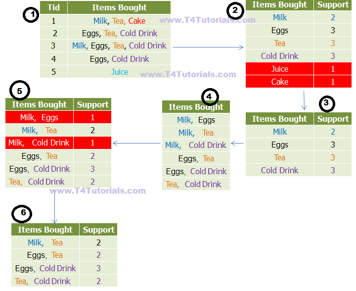
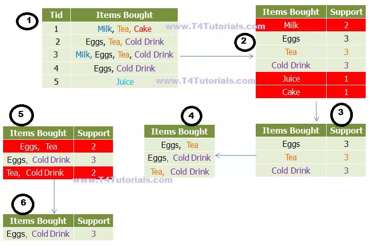

# 분석Day12

>  키워드연관분석, 장바구니분석

### - 교육내용

# 트위터 API로 연관 키워드 분석하기

### 바로가기

- [<Step1. API 호출> : 트위터 API로 데이터 가져오기](#<Step1.-API-호출>-:-트위터-API로-데이터-가져오기)
  - [API 데이터로 데이터 프레임 생성하기]
- [<Step2. 추출> : 키워드 추출](#<Step2.-추출>-:-키워드-추출)
  - [텍스트 데이터 전처리]
  - [nltk, konlpy를 이용한 키워드 추출]
- [<Step3. 분석> : 연관 분석을 이용한 키워드 분석](#<Step3.-분석>-:-연관-분석을-이용한-키워드-분석)
  - [연관 키워드 추출하기]
  - [단어 빈도 추출하기]
- [<Step4. 시각화> : 연관 키워드 네트워크 시각화](#<Step4.-시각화>-:-연관-키워드-네트워크-시각화)
  - [연관 키워드 네트워크 시각화]

-----


```python
import pandas as pd
import numpy as np
import matplotlib.pyplot as plt

import warnings
warnings.filterwarnings("ignore")
```

# <Step1. API 호출> : 트위터 API로 데이터 가져오기

-----

##### 트위터 API 가져오기


```python
import tweepy

api_key = "YHZNYTApFnyzZ8AWhRE6VEP1u"
api_secret = "gNM8q6upsdu7ix55xwJtMbsTBUIfmpFfjjklt02xM1VkwUwMk8"
access_token = "1312264326238007301-kPEbzOLfmqNX7cpCdFOJYIRqniA9Lr"
access_token_secret = "r46odN3yRNPo9OsGqRKzT5IezaO3ATffl1mYF2CEpUsBL"

auth = tweepy.OAuthHandler(api_key, api_secret)
auth.set_access_token(access_token, access_token_secret)

# twitter API를 사용하기 위한 준비입니다.
api = tweepy.API(auth)
```


```python
# 크롤링된 데이터를 저장할 데이터 프레임입니다.
columns = ['created', 'tweet_text']
df = pd.DataFrame(columns=columns)

keyword='코로나'

# twitter API를 사용하여 ‘코로나’가 포함된 100페이지의 트윗들을 크롤링한 뒤, ‘text’, ‘created_at’ 정보를 데이터 프레임으로 저장합니다.
for i in range(1,100):
    print("Get data", str(i/100*100), "% complete..")
    tweets = api.search(keyword)
    for tweet in tweets:
        tweet_text = tweet.text
        created = tweet.created_at
        row = [created, tweet_text]
        series = pd.Series(row, index=df.columns)
        df = df.append(series, ignore_index=True)
print("Get data 100 % complete..")
```


```python
df.to_csv("tweet_temp.csv", index=False)
```

# <Step2. 추출> : 키워드 추출

### [텍스트 데이터 전처리]


```python
df = pd.read_csv("tweet_temp.csv")
df.head()
```


```python
import re

# 텍스트 정제 함수 : 한글 이외의 문자는 전부 제거합니다.
def text_cleaning(text):
    hangul = re.compile('[^ ㄱ-ㅣ가-힣]+') # 한글의 정규표현식을 나타냅니다.
    result = hangul.sub('', text)
    return result
```


```python
# ‘tweet_text’ 피처에 이를 적용합니다.
df['ko_text'] = df['tweet_text'].apply(lambda x: text_cleaning(x))
df.head()
```

### [konlpy를 이용한 키워드 추출]


```python
from konlpy.tag import Okt
from collections import Counter

# 한국어 약식 불용어사전 예시 파일입니다. 출처 - (https://www.ranks.nl/stopwords/korean)
korean_stopwords_path = "data/korean_stopwords.txt"
with open(korean_stopwords_path, encoding='utf8') as f:
    stopwords = f.readlines()
stopwords = [x.strip() for x in stopwords]

def get_nouns(x):
    nouns_tagger = Okt()
    nouns = nouns_tagger.nouns(x)
    
    # 한글자 키워드를 제거합니다.
    nouns = [noun for noun in nouns if len(noun) > 1]
    
    # 불용어를 제거합니다.
    nouns = [noun for noun in nouns if noun not in stopwords]
    
    return nouns
```


```python
# ‘ko_text’ 피처에 이를 적용합니다.
df['nouns'] = df['ko_text'].apply(lambda x: get_nouns(x))
print(df.shape)
df.head()
```

# <Step3. 분석> : 연관 분석을 이용한 키워드 분석

### [연관 키워드 추출하기]

##### **연관 분석 연습**


```python
from apyori import apriori

# 장바구니 형태의 데이터(트랜잭션 데이터)를 생성
transactions = [
    ['손흥민', '시소코'],
    ['손흥민', '케인'],
    ['손흥민', '케인', '포체티노']
]

# 연관 분석을 수행
results = list(apriori(transactions))
for result in results:
    print(result)
```


```python
# 데이터 프레임 형태로 정리합니다.
columns = ['source', 'target', 'support']
network_df = pd.DataFrame(columns=columns)

# 규칙의 조건절을 source, 결과절을 target, 지지도를 support 라는 데이터 프레임의 피처로 변환합니다.
for result in results:
    if len(result.items) == 2:
        items = [x for x in result.items]
        row = [items[0], items[1], result.support]
        series = pd.Series(row, index=network_df.columns)
        network_df = network_df.append(series, ignore_index=True)

network_df.head()
```

##### **트위터 연관 키워드 분석**


```python
# 트랜잭션 데이터를 추출합니다.
transactions = df['nouns'].tolist()
#transactions = [transaction for transaction in transactions if transaction] # 공백 문자열을 방지합니다.
print(transactions[:10])
```


```python
# 연관 분석을 수행합니다.
results = list(apriori(transactions,
                        min_support=0.1))
print(results) 
```


```python
# 데이터 프레임 형태로 정리합니다.
columns = ['source', 'target', 'support']
network_df = pd.DataFrame(columns=columns)

# 규칙의 조건절을 source, 결과절을 target, 지지도를 support 라는 데이터 프레임의 피처로 변환합니다.
for result in results:
    if len(result.items) == 2:
        items = [x for x in result.items]
        row = [items[0], items[1], result.support]
        series = pd.Series(row, index=network_df.columns)
        network_df = network_df.append(series, ignore_index=True)

network_df.head()
```

##### 말뭉치 추출


```python
# 말뭉치를 추출합니다.
tweet_corpus = "".join(df['ko_text'].tolist())
print(tweet_corpus)
```


```python
from konlpy.tag import Okt
from collections import Counter

# 명사 키워드를 추출합니다.
nouns_tagger = Okt()
nouns = nouns_tagger.nouns(tweet_corpus)
count = Counter(nouns)

# 한글자 키워드를 제거합니다.
remove_char_counter = Counter({x : count[x] for x in count if len(x) > 1})
print(remove_char_counter)
```

##### 단어 빈도 점수 추가


```python
# 키워드와 키워드 빈도 점수를 ‘node’, ‘nodesize’ 라는 데이터 프레임의 피처로 생성합니다.
node_df = pd.DataFrame(remove_char_counter.items(), columns=['node', 'nodesize'])
node_df = node_df[node_df['nodesize'] >= 50] # 시각화의 편의를 위해 ‘nodesize’ 50 이하는 제거합니다.
node_df.head()
```

# <Step4. 시각화> : 연관 키워드 네트워크 시각화

### [연관 키워드 네트워크 시각화]


```python
#pip install networkx
import networkx as nx
plt.figure(figsize=(25,25))

# networkx 그래프 객체를 생성합니다.
G = nx.Graph()

# node_df의 키워드 빈도수를 데이터로 하여, 네트워크 그래프의 ‘노드’ 역할을 하는 원을 생성합니다.
for index, row in node_df.iterrows():
    G.add_node(row['node'], nodesize=row['nodesize'])
    
# network_df의 연관 분석 데이터를 기반으로, 네트워크 그래프의 ‘관계’ 역할을 하는 선을 생성합니다.
for index, row in network_df.iterrows():
    G.add_weighted_edges_from([(row['source'], row['target'], row['support'])])
    
# 그래프 디자인과 관련된 파라미터를 설정합니다.
pos = nx.spring_layout(G, k=0.6, iterations=50)
sizes = [G.nodes[node]['nodesize']*25 for node in G]
nx.draw(G, pos=pos, node_size=sizes)

# Windows 사용자는 AppleGothic 대신,'Malgun Gothic'. 그 외 OS는 OS에서 한글을 지원하는 기본 폰트를 입력합니다.
nx.draw_networkx_labels(G, pos=pos, font_family='Malgun Gothic', font_size=25)

# 그래프를 출력합니다.
ax = plt.gca()
plt.show()
```


# 연관분석(장바구니분석)

## 빈발항목집합을 추출하는 Apriori algorithm 의 원리

### 최소지지도 이상을 갖는 항목집합을 빈발항목집합(frequent item set)이라고 한다.

### 모든 항목집합에 대한 지지도를 계산하는 대신에 최소 지지도 이상의 빈발항목집합만을 찾아내서 연관규칙을 계산하는 것이 

### Apriori algorithm의 주요 내용이다.

### [ 빈발항목집합 추출의 Apriori Principle ]

#### (1) 한 항목집합이 빈발(frequent)하다면 이 항목집합의 모든 부분집합은 역시 빈발항목집합이다.

####    (frequent item sets -> next step) 

#### (2) 한 항목집합이 비빈발(infrequent)하다면 이 항목집합을 포함하는 모든 집합은 비빈발항목집합이다. 

####    (superset -> pruning) 

## 지지도(support) s(X→Y) 

### X와 Y를 모두 포함하는 거래 수 / 전체 거래 수  

## 신뢰도(Confidence) c(X→Y) 

### X와 Y를 모두 포함하는 거래 수 / X가 포함된 거래 수

## 향상도(Lift)

### 연관규칙의 신뢰도/지지도 





```python
import pandas as pd
```


```python
from apyori import apriori

baskets = [
    ['Milk', 'Tea', 'Cake'],
    ['Eggs', 'Tea', 'Cold Drink'],
    ['Milk', 'Eggs', 'Tea', 'Cold Drink'],
    ['Eggs', 'Cold Drink'],
    ['Juice']
]
association_result = list(apriori(baskets, min_support=0.4))
```


```python
import pandas as pd

columns = ['source', 'target', 'support']
network_df = pd.DataFrame(columns=columns)
for result in  association_result:
    if len(result.items) == 2:
        items = [x for x in result.items]
        row = [items[0], items[1], result.support]
        series = pd.Series(row, index=network_df.columns)
        network_df = network_df.append(series, ignore_index=True)
network_df.head(10)
```




```python
from apyori import apriori

baskets = [
    ['Milk', 'Tea', 'Cake'],
    ['Eggs', 'Tea', 'Cold Drink'],
    ['Milk', 'Eggs', 'Tea', 'Cold Drink'],
    ['Eggs', 'Cold Drink'],
    ['Juice']
]
association_result = list(apriori(baskets, min_support=0.6))
```


```python
columns = ['source', 'target', 'support']
network_df = pd.DataFrame(columns=columns)
for result in  association_result:
    if len(result.items) == 2:
        items = [x for x in result.items]
        row = [items[0], items[1], result.support]
        series = pd.Series(row, index=network_df.columns)
        network_df = network_df.append(series, ignore_index=True)
network_df.head(10)
```


```python
from apyori import apriori

baskets = [
    ['계란', '우유'],
    ['계란', '기저귀', '맥주', '사과'],
    ['우유', '기저귀', '맥주', '콜라'],
    ['계란', '우유', '맥주', '기저귀'],
    ['계란', '우유', '멕주', '콜라']
]
association_result = list(apriori(baskets, min_support=0.4))
```


```python
association_result
```


```python
columns = ['source', 'target', 'support']
network_df = pd.DataFrame(columns=columns)
for result in  association_result:
    if len(result.items) == 2:
        items = [x for x in result.items]
        row = [items[0], items[1], result.support]
        series = pd.Series(row, index=network_df.columns)
        network_df = network_df.append(series, ignore_index=True)
network_df.head(10)
```


```python
import pandas as pd
from mlxtend.preprocessing import TransactionEncoder
from mlxtend.frequent_patterns import apriori
```


```python
dataset= [['양말','팬티','신발'],
         ['신발','바지','팬티','셔츠'],
         ['모자','양말','신발'],
         ['신발','바지','팬티','장갑']]
```


```python
t = TransactionEncoder()
t_a = t.fit(dataset).transform(dataset)
df = pd.DataFrame(t_a, columns = t.columns_)
df
```


```python
frequent = apriori(df, min_support=0.5, use_colnames=True)
frequent
```

