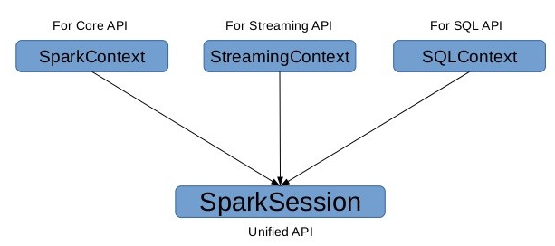
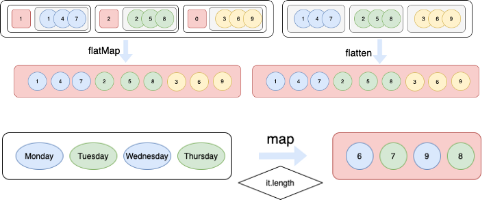

# 분석Day15

>  pyspark활용

### - 교육내용

# **pyspark 패키지를 활용한 Spark 프로그래밍**

## SparkSession 객체 생성


```python
# 숫자는 코어 개수
import pyspark
from pyspark.sql import SparkSession
spark = SparkSession.builder.master("local[2]") \
                    .appName('sparkedu') \
                    .getOrCreate()
spark
```



## 리스트객체로 RDD 객체 생성하기

### RDD(Resilient Distributed Dataset)

#### read-only 데이터셋으로서 다양한 머신에 데이터셋의 멀티셋(중복을 허용)을 분산해두고 특정한 머신에 문제가 생기더라도 문제없이 읽을수로 있도록 지원한다

- MapReduce 작업
- 분산하여 병렬적 처리
- 빠른 연산
- 불변(Immutable)
- Transformation 과 Action 으로 함수 종류가 나눠지며, Action 함수가 실행됐을 때 실제 연산
- Lineage 를 통해 Fault Tolerant(내고장성) 보장


```python
dataList = [("Java", 20000), ("Python", 100000), ("Scala", 3000)]
rdd=spark.sparkContext.parallelize(dataList)

print(rdd)
print(type(rdd))
print(rdd.collect())
```


```python
import numpy as np
lst=np.random.randint(0,10,20)
rdd=spark.sparkContext.parallelize(lst)

print(rdd)
print(type(rdd))
print(rdd.collect())
print(rdd.count())
print(rdd.first())
print(rdd.take(5))
```

## 텍스트 파일 내용 읽어서 RDD 객체 생성하기


```python
rdd = spark.read.text("data/korean_stopwords.txt")
print(type(rdd))
print(rdd.collect())
rdd.show()
```


```python
rdd = spark.sparkContext.textFile("data/korean_stopwords.txt")
print(type(rdd))
print(rdd.collect())

```

## 생성한 RDD 객체 Spark DataFrame 으로 변환하기

### Spark DataFrame

- DataFrame은 명명 된 열로 구성된 데이터 세트 
- 개념적으로는 관계형 데이터베이스의 테이블 또는 R / Python의 데이터 프레임과 동일하지만 내부적으로 더욱  최적화가 있음
- RDB Table처럼 Schema를 가지고 있고 RDB의 Table 연산이 가능
- 구조화 된 데이터 파일, Hive의 테이블, 외부 데이터베이스 또는 기존 RDD와 같은 다양한 소스 에서 구성 할 수 있늠 
- DataFrame API는 Scala, Java, Python 및 R 에서 사용할 수 있음
- SparkSQL을 통해 사용 가능


```python
dept = [("Finance",10), 
        ("Marketing",20), 
        ("Sales",30), 
        ("IT",40) 
      ]
rdd = spark.sparkContext.parallelize(dept)
print(rdd.collect())
```


```python
df = rdd.toDF()
print(type(rdd))
print(type(df))
print(df.collect())
print('----------------')
df.printSchema()
df.show()
```


```python
deptColumns = ["dept_name","dept_id"]
df2 = rdd.toDF(deptColumns)
df2.printSchema()
df2.show(truncate=False)
```


```python
data = [('James','','Smith','1991-04-01','M',3000),
  ('Michael','Rose','','2000-05-19','M',4000),
  ('Robert','','Williams','1978-09-05','M',4000),
  ('Maria','Anne','Jones','1967-12-01','F',4000),
  ('Jen','Mary','Brown','1980-02-17','F',-1)
]

columns = ["firstname","middlename","lastname","dob","gender","salary"]
df = spark.createDataFrame(data=data, schema = columns)
print(type(df))
print(df)
df.printSchema()
df.show()
```


```python
from pyspark.sql.types import StructType,StructField, StringType, IntegerType
data2 = [("James","","Smith","36636","M",3000),
    ("Michael","Rose","","40288","M",4000),
    ("Robert","","Williams","42114","M",4000),
    ("Maria","Anne","Jones","39192","F",4000),
    ("Jen","Mary","Brown","","F",-1)
  ]

schema = StructType([ \
    StructField("firstname",StringType(),True), \
    StructField("middlename",StringType(),True), \
    StructField("lastname",StringType(),True), \
    StructField("id", StringType(), True), \
    StructField("gender", StringType(), True), \
    StructField("salary", IntegerType(), True) \
  ])
 
df = spark.createDataFrame(data=data2,schema=schema)
df.printSchema()
df.show(truncate=False)
```

## CSV 파일 내용 읽어서 DataFrame 객체 생성하기


```python
df = spark.read.csv("data/emp.csv")
print(type(df))
df.printSchema()
df.show()
```


```python
emp = spark.read.csv("data/emp.csv", header=True)
emp.printSchema()
emp.show()
```


```python
emp = spark.read.csv("data/emp.csv", header=True, inferSchema=True)
emp.printSchema()
emp.show()
```


```python
df = spark.read.csv("data/mpgdata.csv")
df.printSchema()
df.show()

df1 = spark.read.csv("data/mpgdata.csv", header=True, inferSchema=True)
df1.printSchema()
df1.show()
```


```python
df = spark.read.load("data/iris.csv",
                     format="csv", sep=",", inferSchema=True, header=True)
df.printSchema()
df.show()


# df1 = spark.read.load("data/stock valuation.xlsx",
#                      format="excel", sep=",", inferSchema=True, header=True)
# df1.printSchema()
# df1.show()
```

## JSON 파일 내용 읽어서 DataFrame 객체 생성하기


```python
df = spark.read.json("data/seoul_geo.json")
df.show()
```


```python
df = spark.read.load("data/seoul_geo.json", format="json")
df.show()
```

## 파케이 파일 내용 읽어서 DataFrame 객체 생성하기


```python
df = spark.read.load("data/userdata1.parquet")
df.show()
df = df.select("first_name", "last_name", "email")
df.show()
```

## 직접 만든 DataFrame 객체 생성하여 정보 출력하기


```python
data = [("James","","Smith","36636","M",60000),
        ("Michael","Rose","","40288","M",70000),
        ("Robert","","Williams","42114","",400000),
        ("Maria","Anne","Jones","39192","F",500000),
        ("Jen","Mary","Brown","","F",0)]

columns = ["first_name","middle_name","last_name","dob","gender","salary"]
pysparkDF = spark.createDataFrame(data = data, schema = columns)
pysparkDF.printSchema()
pysparkDF.show(truncate=False)
print(type(pysparkDF))
```

## Spark의 DataFrame 객체를 Pandas의 DataFrame 객체로 변환하기


```python
pandasDF = pysparkDF.toPandas()
print(type(pandasDF))
print(pandasDF)
```

## select()


```python
emp1 = emp.select("empno", "ename", "hiredate", "sal")
print(type(emp1))
emp1.show()
```


```python
emp.select(emp.empno,emp.ename,emp.hiredate, emp.sal).show()
```


```python
# Using col function
from pyspark.sql.functions import col
print(type(df))
emp.select(col("empno"),col("ename"),col("hiredate"),col("sal")).show()
```

## collect()


```python
print(type(emp))
dataCollect = emp.collect()
print(type(dataCollect))
print("----------------------------")
print(dataCollect)
print("----------------------------")
display(dataCollect)
```


```python
emp.printSchema()
```

## withColumn()


```python
newemp = emp.withColumn("deptno",col("deptno").cast("Integer"))
# newemp = emp.withColumn("deptno",col("deptno").cast("string"))
newemp.printSchema()
```


```python
newemp = newemp.withColumn("sal",col("sal")*100)
newemp = newemp.withColumn("sal2",col("sal")*1000)
newemp.show()
```

## withColumnRenamed()


```python
newemp = newemp.withColumnRenamed("sal","salary")
newemp.show()
```


```python
newemp = newemp.withColumnRenamed("mgr","manager") \
    .withColumnRenamed("ename","empname")
newemp.show()
```

## filter() - where() 와 동일


```python
emp.filter(emp.ename == "KING").show(truncate=False)
```


```python
emp.filter('ename == "KING"').show(truncate=False)
```


```python
emp.filter((emp.deptno == 30) & (emp.sal >= 1500)).show(truncate=False)
```


```python
emp.where((emp.deptno == 30) & (emp.sal >= 1500)).show(truncate=False)
```

## distinct(), drop (), dropDuplicates ()


```python
empnew = emp.select("job", "deptno")
empnew.show()
```


```python
empnew.distinct().show()
```


```python
empnew.dropDuplicates().show()
```


```python
empnew.drop("deptno").show()
```

## orderBy(), sort()


```python
emp.sort("sal").show(truncate=False)
```


```python
emp.sort(emp.sal.desc()).show(truncate=False)
```


```python
emp.sort("deptno", "sal").show(truncate=False)
```


```python
emp.sort(emp.deptno.desc(), emp.sal.desc()).show(truncate=False)
```


```python
emp.orderBy(emp.deptno.desc(), emp.sal.desc()).show(truncate=False)
```


```python
emp.sort(col("hiredate").asc(),col("sal").asc()).show(truncate=False)
emp.orderBy(col("hiredate").asc(),col("sal").asc()).show(truncate=False)
```

## groupBy()


```python
emp.groupBy("deptno").sum("sal").show(truncate=False)
```


```python
emp.groupBy("deptno").min("sal").show(truncate=False)
```


```python
emp.groupBy("deptno").max("sal").show(truncate=False)
```


```python
emp.groupBy("deptno").avg("sal").show(truncate=False)
```


```python
emp.groupBy("deptno").avg("sal").show(truncate=False)
```


```python
emp.groupBy("deptno", "job").sum("sal").show(truncate=False)
```


```python
emp.groupBy("deptno").sum("sal", "comm").show(truncate=False)
```


```python
from pyspark.sql.functions import sum,avg,max,min,mean,count
emp.groupBy("deptno").agg(sum("sal"), avg("sal"), max("sal"), min("sal"), mean("sal")).show(truncate=False)
```


```python
emp.groupBy("deptno") \
    .agg(sum("sal").alias("sum_salary"), \
         avg("sal").alias("avg_salary"), \
         max("sal").alias("max_salary"), \
         min("sal").alias("min_salary"), \
         mean("sal").alias("mean_salary"), \
     ) \
    .show(truncate=False)
```


```python
emp.groupBy("deptno") \
    .agg(sum("sal").alias("sum_salary"), \
         avg("sal").alias("avg_salary"), \
         max("sal").alias("max_salary"), \
         min("sal").alias("min_salary"), \
         mean("sal").alias("mean_salary"), \
     ) \
    .where(col("sum_salary") > 9000)\
    .show(truncate=False)
```


```python
deptdata = [(10, '영업부', '서울'), (20, '개발부', '대전'), (30, '기획부', '서울'), (40, '마케팅부', '서울')]
deptcolname = ['deptno', 'dname', 'loc']
dept = spark.createDataFrame(data=deptdata, schema=deptcolname)
dept.show(truncate=False)
```

## join()


```python
emp.join(dept,emp.deptno ==  dept.deptno,"inner") \
     .show(truncate=False)
```


```python
emp.join(dept,emp.deptno ==  dept.deptno,"right") \
     .show(truncate=False)
```

## union()


```python
emp1 = emp.filter("job == 'MANAGER'").select("ename", "sal")
emp2 = emp.filter("deptno == 30").select("ename", "sal")
emp1.show()
emp2.show()
emp1.union(emp2).show()
```


```python
emp1 = emp.filter("job == 'MANAGER'").select("ename", "sal")
emp2 = emp.filter("deptno == 30").select("ename", "sal")
emp1.show()
emp2.show()
emp1.union(emp2).dropDuplicates().show()
```

## **map() 과 flatMap()**

### lines = [['w1',  'w2', 'w3'], ['w4', 'w5', 'w6']]

### lines를 map/flatmap을 이용하여 split하게 되면 아래와 같다.

### map: one2one mapping

###	Array(Array('w1', 'w2', 'w3'), Array('w4', 'w5', 'w6'))

### flatmap: one example → one result(flatten)

### Array('w1', 'w2', 'w3', 'w4', 'w5', 'w6')




```python
data = ["둘리 또치 도우너 희동이 고길동 마이콜",
        "피카츄 꼬부기 잠만보",
        "듀크 턱시",
        "프로도 간달프 스미골",
        "코코"]
rdd=spark.sparkContext.parallelize(data)
for element in rdd.collect():
    print(element)
```


```python
rdd2=rdd.map(lambda x: x.split(" "))
rdd2.collect()
```


```python
rdd2=rdd.flatMap(lambda x: x.split(" "))
rdd2.collect()
```


```python
spark.sparkContext.parallelize([3,4,5]).map(lambda x: range(1,x)).collect() 
```


```python
spark.sparkContext.parallelize([3,4,5]).flatMap(lambda x: range(1,x)).collect() 
```


```python
spark.sparkContext.parallelize([3,4,5]).map(lambda x: [x,  x*x]).collect() 
```


```python
spark.sparkContext.parallelize([3,4,5]).flatMap(lambda x: [x,  x*x]).collect() 
```


```python
lines = spark.sparkContext.textFile("data/greeting.txt")
sorted(lines.flatMap(lambda line: line.split()).map(lambda w: (w,1)).reduceByKey(lambda v1, v2: v1+v2).collect())
```


```python
rdd1 = spark.sparkContext.textFile("data/greeting.txt")
print(type(rdd1))
print(rdd1)
print(rdd1.collect())
print("------------------------------------------------------------------------------")
rdd2 = rdd1.flatMap(lambda line: line.split())
print(type(rdd2))
print(rdd2)
print(rdd2.collect())
print("------------------------------------------------------------------------------")
rdd3 = rdd2.map(lambda w: (w,1))
print(type(rdd3))
print(rdd3)      
print(rdd3.collect())
print("------------------------------------------------------------------------------")
rdd4 = rdd3.reduceByKey(lambda v1, v2: v1+v2)
print(type(rdd4))
print(rdd4)
print(rdd4.collect())
print("------------------------------------------------------------------------------")
result = rdd4.collect()
print(type(result))
print(result)
```